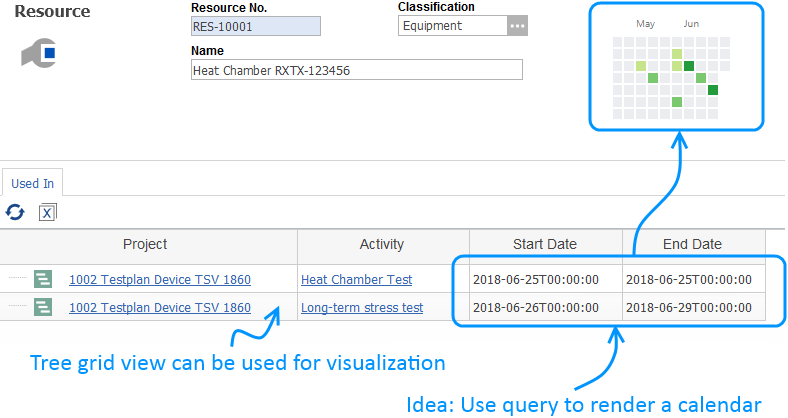
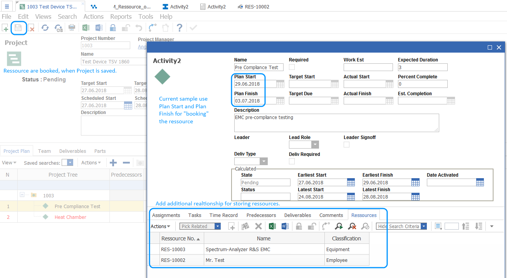

# Add Resource Management to Aras Project Management

## Description

**Important: This is only a first draft and not a working project!**
**For evaluation purposes only! Use this project only in a dedicated test environment! Not recommended for use in production!**
**Always back up your code tree and database before applying an import package or code tree patch!**

## Project Details

#### Built Using:
Aras 11.0 SP11

## Concept

1. Import package adds an ItemType for **Resource** and an additional Relationship Tab in Activity 2.
2. Package contains Methods for a simple date range check.

Tree grid view is not included in Import Package.

## Contributing

1. Fork it!
2. Create your feature branch: `git checkout -b my-new-feature`
3. Commit your changes: `git commit -am 'Add some feature'`
4. Push to the branch: `git push origin my-new-feature`
5. Submit a pull request

## Credits

Created by @AngelaIp

## License

This project is published to Github under the Microsoft Public License (MS-PL). See the [LICENSE file](./LICENSE.md) for license rights and limitations.